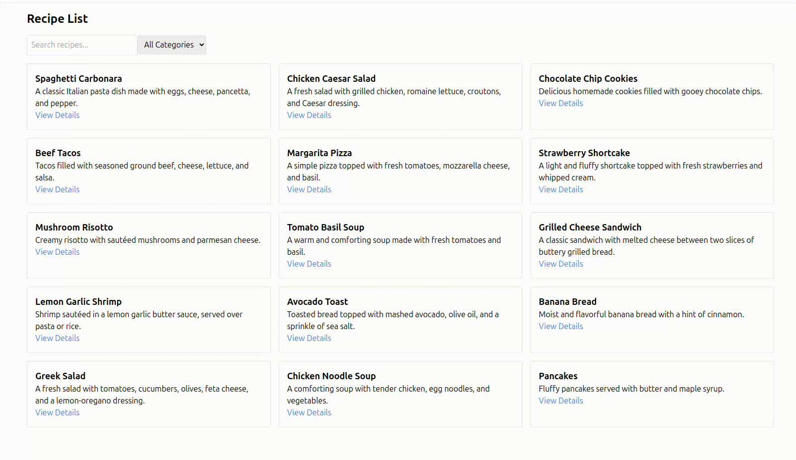

# recipe-book

## Overview
A simple recipe book application built with Vue.js 3, Vue Router, Vuex, and Tailwind CSS. Users can browse, search, filter, and save their favorite recipes.

## Features
- Browse and search for recipes
- Filter by category or ingredient
- Save favorite recipes

## Screenshot




## Project setup
```
npm install
```

### Compiles and hot-reloads for development
```
npm run serve
```

